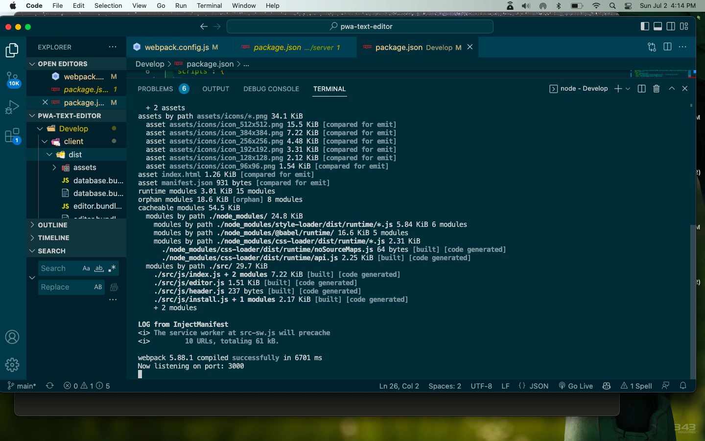
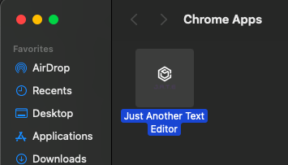

## 19 Progressive Web Applications (PWA) : Text Editor


## Description

The application is a web text editor where the user can create notes or code snippets with or without an internet connection and where the user can reliably retrieve them for later use.  The integrated service worker and Cache API's ensure that the application will remain fully functional even without and active internet connection.  This application allows the user to access visited pages even if the application is offline.

The URL of the GitHub repository is https://github.com/taylor-green/pwa-text-editor.


## Table of Contents

* [Installation](#installation)
* [Usage](#usage)
* [References](#references)
* [License](#license)

## Installation

1.  The application requires Node.js and MongoDB to be installed.  The application also requires the following dependencies.  The dependencies are included in the package.json file:- After you clone the repo to your local machine, you should run npm i to get all dependencies installed.     

## Usage

1.  The application can be invoked by using the following command:- npm run start. The user will then be able to access the application from their browser at localhost:3001.  The application can also be accessed from the deployed Heroku URL. The user will also be able to install the app to their local machine and use it offline.


2.
``````
    WHEN I run `npm run start` from the root directory
    THEN I find that my application should start up the backend and serve the client
    WHEN I run the text editor application from my terminal
    THEN I find that my JavaScript files have been bundled using webpack
    WHEN I run my webpack plugins
    THEN I find that I have a generated HTML file, service worker, and a manifest file
``````
*Below is the screenshot of the running at npm run start and npm run build* 




3.
``````
WHEN I use next-gen JavaScript in my application
THEN I find that the text editor still functions in the browser without errors
WHEN I open the text editor
``````
*Below is the screenshot of the text editor "Just Another Text Editor (J.A.T.E)"*


4.
``````
THEN I find that IndexedDB has immediately created a database storage
WHEN I enter content and subsequently click off of the DOM window
THEN I find that the content in the text editor has been saved with IndexedDB
WHEN I reopen the text editor after closing it
THEN I find that the content in the text editor has been retrieved from our IndexedDB
``````


5.
``````
WHEN I click on the Install button
THEN I download my web application as an icon on my desktop
``````
*Below is the screenshot of the installed app*




## References

*   The Unit Ahead : Progressive Web Applications (PWA)
*   Module 19 Mini-Project: Deploy Contact Directory App on Heroku with Script
*   Request-Response : The Full-Stack Blog : Heroku Deployment Guide
 
## License

This project is licensed under the terms of the MIT license.
